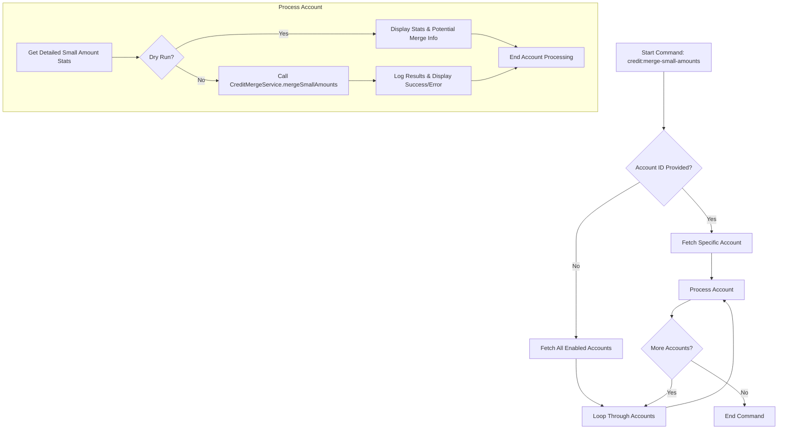
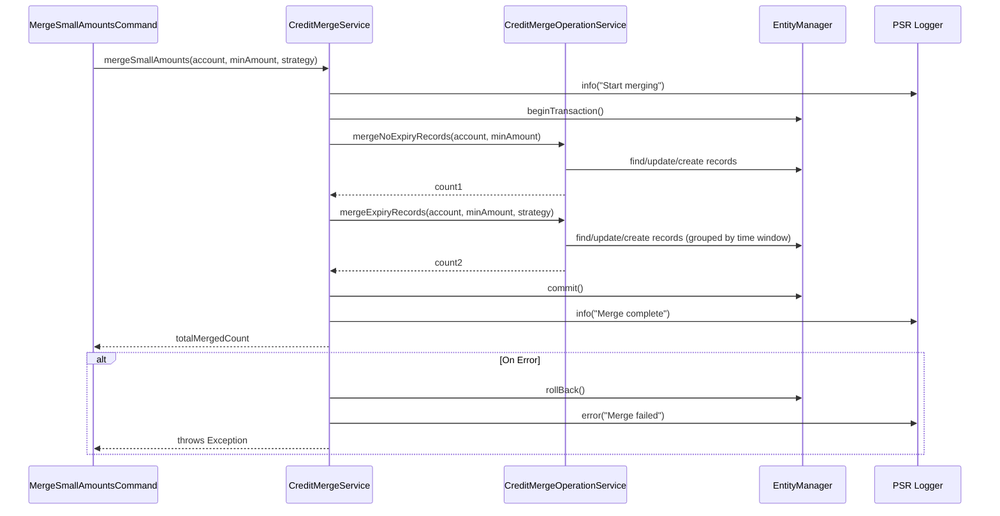

# Credit Merge Bundle Workflow

This document outlines the workflows involved in the Credit Merge Bundle, focusing on how small credit transactions are identified and merged.

## Manual Merge Process (via `credit:merge-small-amounts` Command)

The `credit:merge-small-amounts` command allows for manual or scheduled merging of small credit transactions. Here's a simplified flow:



This diagram shows:

- The command can target a specific account or all enabled accounts.
- For each account, it first gathers statistics about small-value credits.
- If not in dry-run mode, it proceeds to merge these credits using `CreditMergeService`.
- The time window strategy, minimum amount, and batch size are passed as parameters.

## Automatic Merge Process (Triggered by Large Consumption - `CreditSmallAmountsMergeService`)

This service can be triggered before a significant credit consumption to proactively merge small amounts, potentially optimizing the consumption process.

```mermaid
flowchart TD
    AA[Large Credit Consumption Attempt] --> AB{Auto Merge Enabled? (`CREDIT_AUTO_MERGE_ENABLED`)};
    AB -- No --> AC[Proceed with Consumption];
    AB -- Yes --> AD{Cost Amount >= Min Auto Merge Amount? (`CREDIT_AUTO_MERGE_MIN_AMOUNT`)};
    AD -- No --> AC;
    AD -- Yes --> AE[Get Consumption Preview (TransactionRepository)];
    AE --> AF{Preview Needs Merge? (Record count > `CREDIT_AUTO_MERGE_THRESHOLD`)};
    AF -- No --> AC;
    AF -- Yes --> AG[Log Merge Start];
    AG --> AH[Execute Merge (TransactionRepository.mergeSmallAmounts)];
    AH --> AI[Log Merge Complete];
    AI --> AC;
```

This diagram illustrates:

- The automatic merge is conditional based on environment variable settings and the amount being consumed.
- It checks a preview of the consumption to see if the number of records involved exceeds a threshold.
- If conditions are met, it performs a merge operation before the main consumption proceeds.

## Core Merging Logic (`CreditMergeService.mergeSmallAmounts`)

This is the central service method responsible for the actual merging logic.

```mermaid
flowchart TD
    S1[Call mergeSmallAmounts(account, minAmount, batchSize, timeWindowStrategy)] --> S2[Start DB Transaction];
    S2 --> S3[Process No Expiry Records (CreditMergeOperationService.mergeNoExpiryRecords)];
    S3 --> S4[Process Expiry Records (CreditMergeOperationService.mergeExpiryRecords with strategy)];
    S4 --> S5[Commit DB Transaction];
    S5 --> S6[Log Completion & Return Merge Count];
    S2 -- On Exception --> S7[Rollback DB Transaction];
    S7 --> S8[Log Error & Rethrow];
```

This diagram highlights:

- The operation is transactional.
- It separately handles records with no expiration and those with expiration dates, applying the specified time window strategy for the latter.

## Component Interaction (Simplified)



This sequence shows the interaction between the command, the main merge service, the operation service (which likely handles the direct database interactions or repository calls), the entity manager for transactions, and the logger.
